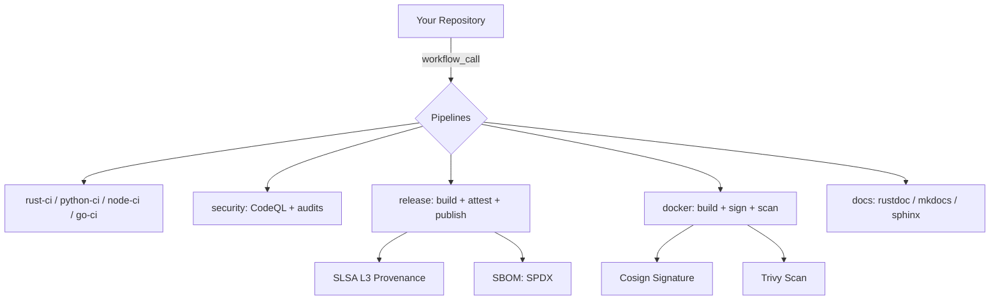

<p align="center">
  
</p>

<h1 align="center">Pipelines</h1>

<p align="center">
  <strong>Reusable CI/CD templates for the Sebastien Rousseau ecosystem — built for security, speed, and minimal billing.</strong>
</p>

<p align="center">
  <a href="https://github.com/sebastienrousseau/pipelines/actions"></a>
  <a href="https://scorecard.dev/viewer/?uri=github.com/sebastienrousseau/pipelines"></a>
  <a href="https://github.com/sebastienrousseau/pipelines/releases"></a>
  <a href="LICENSE-MIT"></a>
</p>

---

## Install

Add a caller workflow to your repository:

```yaml
# .github/workflows/ci.yml
name: CI
on: [push, pull_request]

jobs:
  ci:
    uses: sebastienrousseau/pipelines/.github/workflows/rust-ci.yml@main
    with:
      run-coverage: true
    secrets:
      CODECOV_TOKEN: ${{ secrets.CODECOV_TOKEN }}
```

Copy the templates for dependency management:

```bash
cp templates/dependabot.yml .github/dependabot.yml
cp templates/labeler.yml    .github/labeler.yml
```

Works with Rust, Python, Node.js, and Go. See [`examples/`](examples/) for complete caller workflows.

---

## Overview

Pipelines provides standardised GitHub Actions workflows that you call from your repositories. One workflow definition, shared across all projects. All actions are pinned by commit SHA, all jobs run with least-privilege permissions, and all releases include SLSA Build Level 3 provenance attestations.

- **SHA-pinned actions** prevent supply chain attacks (post-CVE-2025-30066)
- **SLSA Build Level 3** attestations on every release artifact
- **Sigstore container signing** with cosign keyless OIDC
- **OIDC Trusted Publishing** for PyPI, npm, and crates.io
- **SBOM generation** (SPDX) for EU CRA compliance

---

## Architecture



---

## Features

| | |
| :--- | :--- |
| **Languages** | Rust, Python, Node.js/TypeScript, Go — each with a consolidated single-job CI pipeline |
| **Security** | SHA-pinned actions, `permissions: {}` default, CodeQL, cargo-audit, pip-audit, npm audit, govulncheck |
| **Supply chain** | SLSA L3 attestations, Sigstore cosign signing, OIDC Trusted Publishing, SBOM on all releases |
| **Releases** | Automated publishing to crates.io, PyPI, npm with provenance. Go binary cross-compilation |
| **Docker** | Multi-platform builds, GHCR/Docker Hub, cosign signing, Trivy scanning, SBOM generation |
| **Documentation** | Rustdoc, MkDocs, Sphinx, static — with GitHub Pages deployment |
| **Efficiency** | Shallow clones, aggressive caching, job consolidation, ARM64 runner support (39% cheaper) |
| **Compliance** | OpenSSF Scorecard, SPDX SBOMs, EU CRA ready, WCAG-compatible docs |

---

## Available Workflows

| Workflow | Purpose | Languages |
| :--- | :--- | :--- |
| `rust-ci.yml` | fmt, clippy, test, audit, coverage | Rust |
| `python-ci.yml` | ruff, mypy, pytest, coverage | Python |
| `node-ci.yml` | lint, typecheck, test, build | Node.js/TypeScript |
| `go-ci.yml` | vet, staticcheck, test, coverage | Go |
| `release.yml` | Build, attest, SBOM, publish | Rust, Python, Node, Go |
| `security.yml` | Language-specific audits + CodeQL | All |
| `docker.yml` | Build, push, sign, scan, attest | All |
| `docs.yml` | Build and deploy to GitHub Pages | All |
| `labeler.yml` | Auto-label PRs by file path + size | All |
| `stale.yml` | Mark and close stale issues/PRs | All |

---

## First 5 Minutes

### Rust

```yaml
jobs:
  ci:
    uses: sebastienrousseau/pipelines/.github/workflows/rust-ci.yml@main
    with:
      run-coverage: true
    secrets:
      CODECOV_TOKEN: ${{ secrets.CODECOV_TOKEN }}
```

### Python (with OIDC Trusted Publishing)

```yaml
jobs:
  ci:
    uses: sebastienrousseau/pipelines/.github/workflows/python-ci.yml@main
    with:
      package-manager: uv
      run-coverage: true

  release:
    if: startsWith(github.ref, 'refs/tags/v')
    uses: sebastienrousseau/pipelines/.github/workflows/release.yml@main
    with:
      language: python
    permissions:
      contents: write
      id-token: write
      attestations: write
```

### Node.js (with npm provenance)

```yaml
jobs:
  ci:
    uses: sebastienrousseau/pipelines/.github/workflows/node-ci.yml@main
    with:
      node-version: '22'
      package-manager: pnpm
```

### Go

```yaml
jobs:
  ci:
    uses: sebastienrousseau/pipelines/.github/workflows/go-ci.yml@main
    with:
      go-version: '1.23'
      run-coverage: true
```

### Docker (with Sigstore signing)

```yaml
jobs:
  docker:
    uses: sebastienrousseau/pipelines/.github/workflows/docker.yml@main
    with:
      image-name: my-app
    permissions:
      contents: read
      packages: write
      id-token: write
      attestations: write
      security-events: write
```

---

## Supply Chain Security

| Control | Implementation |
| :--- | :--- |
| **Action pinning** | All 34 actions pinned by commit SHA (not mutable tags) |
| **SLSA Build L3** | `actions/attest-build-provenance` on all release artifacts |
| **Container signing** | Sigstore/cosign keyless signing via OIDC |
| **Trusted Publishing** | OIDC for PyPI, npm `--provenance`, crates.io |
| **SBOM** | SPDX generated for all releases |
| **Permissions** | `permissions: {}` at workflow level, granular at job level |
| **Scorecard** | Weekly OpenSSF Scorecard self-assessment |

### Verifying Artifacts

```bash
# Verify a release attestation
gh attestation verify my-artifact.tar.gz --repo sebastienrousseau/my-repo

# Verify a signed container image
cosign verify --certificate-identity-regexp='.*' \
  --certificate-oidc-issuer=https://token.actions.githubusercontent.com \
  ghcr.io/sebastienrousseau/my-app:latest
```

---

## Workflow Inputs

<details>
<summary><b>rust-ci.yml</b></summary>

| Input | Type | Default | Description |
| :--- | :--- | :--- | :--- |
| `rust-version` | string | `stable` | Rust toolchain version |
| `cargo-features` | string | `''` | Features to enable (empty = all) |
| `run-clippy` | boolean | `true` | Run clippy linting |
| `run-fmt` | boolean | `true` | Check formatting |
| `run-audit` | boolean | `true` | Run security audit |
| `run-coverage` | boolean | `false` | Generate coverage report |
| `run-cross-platform` | boolean | `false` | Test on macOS and Windows |
| `coverage-exclude` | string | `''` | Files to exclude from coverage |
| `runner` | string | `ubuntu-latest` | Runner label |
| `timeout-minutes` | number | `20` | Timeout for the main job |

</details>

<details>
<summary><b>python-ci.yml</b></summary>

| Input | Type | Default | Description |
| :--- | :--- | :--- | :--- |
| `python-version` | string | `3.12` | Primary Python version |
| `python-versions` | string | `["3.11", "3.12"]` | JSON array for matrix testing |
| `run-mypy` | boolean | `true` | Run type checking |
| `run-ruff` | boolean | `true` | Run ruff linting |
| `run-coverage` | boolean | `false` | Generate coverage report |
| `coverage-threshold` | number | `80` | Minimum coverage % |
| `package-manager` | string | `uv` | poetry, pip, or uv |
| `runner` | string | `ubuntu-latest` | Runner label |
| `timeout-minutes` | number | `15` | Timeout for jobs |

</details>

<details>
<summary><b>node-ci.yml</b></summary>

| Input | Type | Default | Description |
| :--- | :--- | :--- | :--- |
| `node-version` | string | `22` | Node.js version |
| `package-manager` | string | `pnpm` | npm, pnpm, or yarn |
| `working-directory` | string | `.` | Working directory |
| `run-lint` | boolean | `true` | Run linting |
| `run-typecheck` | boolean | `true` | Run type checking |
| `run-tests` | boolean | `true` | Run tests |
| `run-build` | boolean | `true` | Run build |
| `test-coverage` | boolean | `false` | Generate test coverage |
| `runner` | string | `ubuntu-latest` | Runner label |
| `timeout-minutes` | number | `15` | Timeout for the CI job |

</details>

<details>
<summary><b>go-ci.yml</b></summary>

| Input | Type | Default | Description |
| :--- | :--- | :--- | :--- |
| `go-version` | string | `1.23` | Go version |
| `run-vet` | boolean | `true` | Run go vet |
| `run-staticcheck` | boolean | `true` | Run staticcheck |
| `run-coverage` | boolean | `false` | Generate coverage report |
| `run-cross-platform` | boolean | `false` | Test on macOS and Windows |
| `runner` | string | `ubuntu-latest` | Runner label |
| `timeout-minutes` | number | `15` | Timeout for jobs |

</details>

<details>
<summary><b>release.yml</b></summary>

| Input | Type | Default | Description |
| :--- | :--- | :--- | :--- |
| `language` | string | required | rust, python, node, or go |
| `dry-run` | boolean | `false` | Skip actual publish |
| `rust-targets` | string | (linux/amd64) | Cross-compilation targets (Rust) |
| `go-targets` | string | (linux/amd64) | Cross-compilation targets (Go) |

</details>

<details>
<summary><b>security.yml</b></summary>

| Input | Type | Default | Description |
| :--- | :--- | :--- | :--- |
| `language` | string | `auto` | rust, python, node, go, auto |
| `fail-on-vulnerability` | boolean | `true` | Fail on findings |
| `severity-threshold` | string | `medium` | low, medium, high, critical |
| `runner` | string | `ubuntu-latest` | Runner label |

</details>

<details>
<summary><b>docker.yml</b></summary>

| Input | Type | Default | Description |
| :--- | :--- | :--- | :--- |
| `image-name` | string | required | Docker image name |
| `dockerfile` | string | `Dockerfile` | Path to Dockerfile |
| `platforms` | string | `linux/amd64,linux/arm64` | Target platforms |
| `push` | boolean | `true` | Push to registry |
| `registry` | string | `ghcr.io` | Container registry |

</details>

<details>
<summary><b>docs.yml</b></summary>

| Input | Type | Default | Description |
| :--- | :--- | :--- | :--- |
| `type` | string | required | rust, python-mkdocs, python-sphinx, static |
| `deploy` | boolean | `true` | Deploy to GitHub Pages |
| `working-directory` | string | `.` | Working directory |
| `python-version` | string | `3.12` | Python version (for Python docs) |
| `rust-version` | string | `nightly` | Rust toolchain (for Rust docs) |
| `cname` | string | `''` | Custom domain for GitHub Pages |
| `redirect-crate` | string | `''` | Crate name for redirect (Rust) |

</details>

---

## ARM64 Runners

All CI workflows accept a `runner` input. ARM64 runners are 39% cheaper since January 2026:

```yaml
jobs:
  ci:
    uses: sebastienrousseau/pipelines/.github/workflows/rust-ci.yml@main
    with:
      runner: 'ubuntu-24.04-arm'
```

---

## Required Secrets

With Trusted Publishing (OIDC), fewer secrets are needed:

| Secret | Used By | Required? |
| :--- | :--- | :--- |
| `CRATES_TOKEN` | release.yml | Only if Trusted Publishing not configured |
| `PYPI_TOKEN` | release.yml | Only if Trusted Publishing not configured |
| `NPM_TOKEN` | release.yml | Yes (for npm publish) |
| `CODECOV_TOKEN` | *-ci.yml | Optional (for coverage upload) |
| `DOCKER_USERNAME` | docker.yml | Only for Docker Hub (not ghcr.io) |
| `DOCKER_PASSWORD` | docker.yml | Only for Docker Hub (not ghcr.io) |

---

## What's Included

<details>
<summary><b>Templates</b></summary>

Copy these to your repository:

- `templates/dependabot.yml` -> `.github/dependabot.yml` — Automated dependency updates for Cargo, pip, npm, Go, GitHub Actions, Docker
- `templates/labeler.yml` -> `.github/labeler.yml` — PR labels by file path (Rust, Python, Node, Go, CI, Docker, tests, security)

</details>

<details>
<summary><b>Security and compliance</b></summary>

- **SHA-pinned actions** across all 12 workflows (34 unique actions)
- **`permissions: {}`** at workflow level with granular job-level overrides
- **SLSA Build Level 3** provenance via `actions/attest-build-provenance`
- **Sigstore cosign** keyless container signing
- **SBOM** (SPDX) generated for all release artifacts
- **OpenSSF Scorecard** weekly self-assessment
- **CodeQL** static analysis for all supported languages
- **Dependency review** on pull requests
- **Language-specific audits** — cargo-audit, cargo-deny, pip-audit, bandit, npm audit, govulncheck

</details>

<details>
<summary><b>Billing optimisation</b></summary>

- **Job consolidation** — Python CI: 2 jobs (was 5), Node CI: 1 job (was 4)
- **Shallow clones** with `fetch-depth: 1`, `persist-credentials: false`
- **Aggressive caching** — Rust cache, Node cache, uv, setup-go
- **Prebuilt binaries** via `taiki-e/install-action` (seconds vs minutes)
- **Timeouts on every job** — prevents runaway billing
- **Short artifact retention** — 1-7 days per use case
- **ARM64 runner support** — 39% cheaper since January 2026
- **`CARGO_PROFILE_DEV_DEBUG: 0`** — 30-50% less Rust compile time in CI
- **`CARGO_REGISTRIES_CRATES_IO_PROTOCOL: sparse`** — fast crate index access

</details>

<details>
<summary><b>Test coverage</b></summary>

- **83 structural assertions** in `tests/validate.sh`
- **actionlint** — zero errors, zero shellcheck warnings
- **yamllint** — zero errors across all YAML files
- **Zero mutable tags** — verified by grep
- **100% permission coverage** — every workflow declares `permissions: {}`
- **100% timeout coverage** — every job has `timeout-minutes`

</details>

---

## Development

```bash
# Validate all workflows
actionlint

# Lint all YAML
yamllint -d '{extends: default, rules: {line-length: {max: 200}, truthy: disable, comments-indentation: disable, document-start: disable}}' .github/workflows/ templates/

# Run the full test suite (83 assertions)
bash tests/validate.sh

# Resolve an action SHA for pinning
gh api repos/actions/checkout/commits/v4 --jq '.sha'
```

See [CONTRIBUTING.md](CONTRIBUTING.md) for SHA pinning requirements and PR guidelines.

---

**THE ARCHITECT** ᛫ [Sebastien Rousseau](https://sebastienrousseau.com)
**THE ENGINE** ᛞ [EUXIS](https://euxis.co) ᛫ Enterprise Unified Execution Intelligence System

---

## License

Dual-licensed under [Apache 2.0](LICENSE-APACHE) or [MIT](LICENSE-MIT), at your option.

<p align="right"><a href="#pipelines">Back to Top</a></p>
